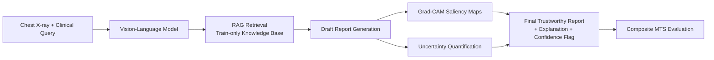

# Complete Project Context: Trustworthy CXR VLM (`trustworthy-cxr-vlm`)

> **Purpose of this Document:**  
> This file contains the complete, exhaustive technical context of the entire project repository (`TrustMedicalVLM` / `mts-medical-vlm`). It documents all architectural and engineering decisions, empirical dataset audits, preprocessing pipelines, data splits, validation studies, codebase structures, test suites, and next roadmap milestones. It is designed to allow any AI assistant (such as Claude) or researcher to immediately understand every single detail without missing context.

---

## 1. Project Identity and Academic Framework

- **Project Title:** Enhancing the Trustworthiness of Vision-Language Models for Chest X-Ray Diagnosis Using RAG, Grad-CAM Explainability, and Uncertainty Estimation, Evaluated with a Composite Medical Trustworthiness Score (MTS)
- **Repository / Workspace Name:** `TrustMedicalVLM` (Git remote: `justinthomas11/mts-medical-vlm`)
- **Institution:** Christ University, Bangalore
- **Program:** M.Tech in Data Science (Master's Dissertation)
- **Author:** Justin Thomas (`justinsthomas2020@gmail.com`)
- **Academic Guide:** Dr. S. A. Sahaaya Arul Mary
- **Project Status:** 
  - **Phase I (Problem Definition & Literature Review):** Complete (30+ papers analyzed; gap identified: no existing work integrates RAG, Grad-CAM, and Uncertainty Estimation under a unified composite evaluation score).
  - **Phase II (Empirical Data Audit, Preprocessing, Splitting & Validation):** 100% Complete and verified via automated test suite.
  - **Phase III (VLM Baseline Selection, S0-S3 Implementation & Evaluation):** In progress.
- **Clinical Disclaimer:** Research prototype only. Not an FDA/CE-cleared medical device; not approved for clinical decision-making.

---

## 2. Core Clinical Motivation & Technical Architecture

### 2.1 The Clinical Problem: Four VLM Failure Modes
Modern Vision-Language Models (e.g., LLaVA-Med, CheXagent) generate fluent radiology reports from chest radiographs, but four critical failure modes prevent clinical deployment:
1. **Hallucination:** Generating plausible-sounding findings with no grounding in verifiable image evidence or patient history.
2. **Lack of Explainability (Black Box):** Clinicians cannot visualize which radiographic anatomical regions or image features drove specific diagnostic assertions.
3. **Stale / Static Knowledge:** Closed-world parametric weights fail to incorporate updated clinical guidelines or rare pathological manifestations.
4. **Uncalibrated Overconfidence:** Generating erroneous diagnostic claims with identical high softmax confidence as correct ones.

### 2.2 The Proposed Solution: Tripartite Trust Integration
This dissertation combines three complementary mechanisms into a single pipeline:
1. **Retrieval-Augmented Generation (RAG):** Dynamic retrieval from a curated medical knowledge base (strictly isolated to training data) to ground text generation.
2. **Visual Explainability (Grad-CAM):** Gradient-weighted Class Activation Mapping highlighting influential spatial compartments in the chest radiograph.
3. **Uncertainty Quantification:** Multi-tiered confidence estimation (autoregressive predictive token entropy + semantic multi-sample CheXbert agreement) to flag low-confidence predictions for human radiologist review.

### 2.3 Proposed Medical Trustworthiness Score (MTS)
A proposed composite metric evaluating models along three essential axes:
$$\text{MTS} = w_1 \cdot \text{Diagnostic Performance} + w_2 \cdot \text{Reliability} + w_3 \cdot \text{Explainability}$$
- **Diagnostic Performance:** Micro- and macro-averaged Precision, Recall, F1, and ROC-AUC across 14 standard thoracic conditions.
- **Reliability:** Calibration error (Expected Calibration Error - ECE, Brier score), Hallucination rate, and inference latency.
- **Explainability:** Localization accuracy via the Pointing Game protocol and Saliency Mass Ratio (SMR) evaluated against condition-specific anatomical masks, complemented by automated clinical validity (RadGraph entity/relation agreement).

### 2.4 Stage-Wise Progressive Ablation (S0 to S3)
To rigorously isolate the contribution of each trust module:
- **Stage S0 (Baseline VLM):** Zero-shot / few-shot standalone VLM generating reports directly from images.
- **Stage S1 (+ RAG):** VLM conditioned on retrieved medical literature and exemplar training reports.
- **Stage S2 (+ RAG + Grad-CAM):** VLM + RAG with visual localization heatmaps for predicted pathologies.
- **Stage S3 (+ RAG + Grad-CAM + Uncertainty):** Complete system outputting report, visual explanation, and confidence flags.



---

## 3. Hardware & Execution Environment

- **Host Machine:** Local Windows 11 workstation.
- **Local GPU:** NVIDIA GeForce RTX 3050 Laptop GPU (6 GB VRAM).
- **System Memory:** 24 GB System RAM.
- **Python Runtime:** Python 3.12.9 (C:\Users\Justin\AppData\Local\Programs\Python\Python312\python.exe).
- **Key Installed Packages:** `torch` (CUDA-enabled), `torchvision`, `pandas`, `numpy`, `Pillow`, `scikit-learn`, `pyyaml`, `pytest`, `seaborn`, `matplotlib`.
- **Compute Strategy (DR-001):**
  - Preprocessing, text cleaning, label extraction, dataset splitting, image transforms, and lightweight model evaluation run locally.
  - For full 7B/8B VLM fine-tuning or unquantized FP16 evaluation exceeding 6 GB VRAM, execution seamlessly transitions to remote GPU environments (Google Colab / Kaggle T4/A100 / cloud compute).

---

## 4. Comprehensive Decision Log (DR-001 through DR-017)

Every engineering and clinical choice is formally documented in `docs/decision_log.md`:

| ID | Title | Status | Core Decision & Rationale |
| :--- | :--- | :---: | :--- |
| **DR-001** | Compute Strategy | Accepted | Local RTX 3050 (6GB) for preprocessing, auditing, unit tests, and quantized baselines; cloud GPU offloading planned for heavy 7B+ FP16 inference. |
| **DR-002** | Dataset Source | Accepted | Use verified local Indiana University Chest X-Ray (IU X-Ray) mirror (7,470 images, 2 CSVs); avoids re-downloading and bypasses PhysioNet/CITI credentialing delays. |
| **DR-003** | Automated Clinical Validity Protocol | Accepted | Certified thoracic radiologist panel unavailable for real-time grading; standardized clinical NLP surrogates adopted: RadGraph (entity/relation F1) and CheXbert diagnostic concordance. |
| **DR-004** | Patient-Level Splitting & RAG Isolation | Accepted | IU X-Ray has multiple images per patient (`uid`). Split strictly at patient level (70/10/20, seed 42) to guarantee zero leakage (`assert len(train_uids & test_uids) == 0`). RAG vector database indexed strictly from `train` partition. |
| **DR-005** | Diagnostic Label Derivation | Accepted | IU X-Ray lacks native multi-label binary ground truth. Extracted 14 CheXpert/NIH categories from text and corroborated with curated NLM MeSH/Problems indexation. |
| **DR-006** | Localization Ground Truth Proxy | Accepted | IU X-Ray has no radiologist bounding boxes. Replaced ad-hoc manual boxes with literature-backed Pointing Game protocol and anatomical priors (superseded in detail by DR-016). |
| **DR-007** | Image View Policy | Accepted | Frontal views (PA/AP) designated as primary diagnostic inputs. Lateral projections preserved in metadata to support future multi-view ablation studies. |
| **DR-008** | Target Text & De-identification | Accepted | Concatenate Findings and Impression into structured target (`FINDINGS: ... \nIMPRESSION: ...`). Normalize hospital de-identification placeholders (`XXXX`) into semantic tags (`[DATE]`, `[AGE]`, `[DOCTOR]`, `[REDACTED]`). |
| **DR-009** | Repository Restructuring | Accepted | Flatten nested subdirectory structure directly into workspace root `TrustMedicalVLM` mapped to GitHub repo `mts-medical-vlm`. |
| **DR-010** | Empty/Partial Section Handling | Accepted | If Findings missing, fallback to Impression; if Impression missing, fallback to Findings. If both empty (<10 chars, 23 records), assign to `excluded_empty_target`. Maximizes usable cohort (3,666 patients). |
| **DR-011** | Negation & Multi-Label Rules | Accepted | Sentence-level negation parsing with forward/backward scopes and adversative boundaries (`but`, `however`) combined with MeSH/Problems concept mapping. |
| **DR-012** | Cryptographic Manifest | Accepted | Calculate SHA256 hashes for all primary diagnostic images across all partitions, saved in `data/processed/splits_manifest.json` for verifiable auditability. |
| **DR-013** | Symmetric CheXbert Scoring | Accepted | Score both reference reports and VLM-generated reports using Stanford CheXbert model. Eliminates labeler-induced asymmetric bias between ground truth and generation. Rule-based labeler retained strictly for offline splitting/audit. |
| **DR-014** | Abnormal Rate Reconciliation | Accepted | Reconciled ~8% divergence between raw audit (64.19%) and initial text regex (72.24%). Curated NLM MeSH/Problems tag is authoritative: if tagged "normal", study is strictly normal (`is_abnormal=0`). Regex extraction populates disease matrix only for non-normal studies. Aligns audit and splits to exactly 64.19%. |
| **DR-015** | Uncertainty Quantification Redesign | Accepted | Dropped MC Dropout because modern VLM autoregressive decoders (LLaMA/Vicuna) have no active dropout during inference. Implemented two-tiered protocol: (1) Token Entropy $H(Y\mid X)$ from greedy logits; (2) Semantic consensus across 5 stochastic sampled completions ($T=0.7$) labeled by CheXbert. |
| **DR-016** | Grad-CAM Redesign & Anatomical Grounding | Accepted | Full backprop through 7B LLM requires ~24GB+ VRAM. Redesign: freeze pretrained vision encoder (CLIP ViT-L/14), train lightweight linear classification head on visual tokens using **train split only**, backprop Grad-CAM into vision encoder. Evaluate Pointing Game / SMR against organ-specific masks from `torchxrayvision` PSPNet (Heart for cardiomegaly, Costophrenic angles for effusion, etc.) rather than trivial whole-lung masks. |
| **DR-017** | Evaluation Ontology Standardization | Accepted | Standardize strictly on CheXbert's native 14-observation ontology for model scoring (S0-S3). Retain rule-based 14 NIH-style matrix for offline preprocessing and stratification. |

---

## 5. Dataset Audit & Preprocessing Empirical Findings

Conducted via `src/data/audit.py` on 100% of raw tabular and image records (`reports/data_audit.md`, `reports/audit_metrics.json`):

### 5.1 Dataset Demographics & Projections
- **Total Patients (`uid`):** 3,851 unique individuals.
- **Total Projections in CSV (`indiana_projections.csv`):** 7,466 rows (100% linked to valid `uid`s, 0 duplicates).
- **Projections Breakdown:** 3,818 Frontal (51.14%), 3,648 Lateral (48.86%).
- **Images per Patient:** Mean = 1.94, Median = 2.0, Range = 1 to 5:
  - 2 images: 3,210 patients (83.36%)
  - 1 image: 446 patients (11.58%)
  - 3 images: 181 patients (4.70%)
  - 4 images: 13 patients (0.34%)
  - 5 images: 1 patient (0.03%)
- **Patient View Availability:**
  - Both Frontal and Lateral: 3,388 patients (87.98%)
  - Frontal only: 301 patients (7.82%)
  - Lateral only: 162 patients (4.21%) — *Excluded from single-view benchmark cohort (DR-007)*
  - Patients with at least one Frontal view: 3,689 patients (95.79%)

### 5.2 Physical Image Files on Disk (`data/raw/images/images_normalized/`)
- **Total Files on Disk:** 7,470 PNG images.
- **Missing Images:** 0 (All 7,466 filenames referenced in projections CSV exist on disk).
- **Orphan Files on Disk:** 4 files present on disk but unreferenced in CSV:
  - `2084_IM-0715-1001-0002.dcm.png`
  - `2084_IM-0715-2001-0001.dcm.png`
  - `2560_IM-1064-4001.dcm.png`
  - `3809_IM-1919-1003002.dcm.png`
- **Corrupt / Unreadable Files:** 0 (All 7,470 verified readable via PIL).
- **Image Mode:** 100% 8-bit Grayscale (`L` mode).
- **Dimensions:** Width: 1,529 to 2,891 px (mean 2,155.77 px); Height: 1,760 to 3,001 px (mean 2,220.37 px).
- **Intensity:** Mean pixel intensity: 147.39 / 255.0; Standard deviation: 25.80 / 255.0 (sampled over 500 images).

### 5.3 Clinical Text Statistics & De-identification
- **Total Reports in CSV (`indiana_reports.csv`):** 3,851 rows (0 duplicate rows).
- **Missing Columns:** `uid` (0), `MeSH` (0), `Problems` (0), `image` (0), `indication` (86 missing, 2.23%), `comparison` (1,166 missing, 30.28%), `findings` (514 missing, 13.35%), `impression` (31 missing, 0.80%).
- **Both Findings & Impression Missing:** 25 reports (0.65%; 23 records with <10 characters).
- **Text Lengths:**
  - Findings: Mean = 27.26 words, Median = 27.0 words, Max = 169 words.
  - Impression: Mean = 10.48 words, Median = 5.0 words, Max = 130 words.
  - Combined Target: Mean = 37.73 words, Median = 34.0 words, Max = 230 words.
- **De-identification Tokens (`XXXX`):** 
  - 7,118 occurrences across 3,052 reports (79.25% of all reports contain $\ge 1$ placeholder).
  - Average of 1.85 tokens per report.
  - Addressed via regex normalization into `[DATE]`, `[AGE]`, `[DOCTOR]`, `[REDACTED]`.

### 5.4 Diagnostic Balance (Full Cohort of 3,851 Patients)
- **Normal Reports:** 1,379 (35.81%)
- **Abnormal Reports:** 2,472 (64.19%)
- **Imbalance Ratio:** 1.79:1 (Abnormal to Normal).

---

## 6. Dataset Partitioning & Cohort Breakdown

Implemented in `src/data/split_dataset.py`, configured in `configs/data_config.yaml`, and summarized in `data/processed/splits_summary.csv`:

### 6.1 Cohort Definitions
- **Total Patients in Raw Data:** 3,851
- **Benchmark Cohort:** 3,666 patients (possessing valid text target $\ge 10$ characters AND at least one frontal radiograph).
- **Excluded Cohorts:**
  - `excluded_lateral_only`: 162 patients (4.21%) lacking frontal projections.
  - `excluded_empty_target`: 23 patients (0.60%) possessing empty/uninformative findings and impressions.

### 6.2 Patient-Level Partitioning Table (Fixed Seed 42, Stratified by `is_abnormal`)

| Split Name | Patients | % of Benchmark | Normal | Abnormal | Abnormal % | Role in Pipeline |
| :--- | :---: | :---: | :---: | :---: | :---: | :--- |
| **`train`** | 2,566 | 69.99% | 924 | 1,642 | 63.99% | Sole training corpus for RAG vector index & visual classifier head |
| **`val`** | 366 | 9.98% | 132 | 234 | 63.93% | Prompt tuning, confidence thresholding, hyperparameter selection |
| **`test`** | 734 | 20.02% | 264 | 470 | 64.03% | Held-out evaluation across S0, S1, S2, and S3 ablation stages |
| `excluded_lateral_only` | 162 | N/A | 36 | 126 | 77.78% | Multi-view / lateral extension studies |
| `excluded_empty_target` | 23 | N/A | 23 | 0 | 0.00% | Excluded from text generation |
| **Total All Patients** | **3,851** | **100.0%** | **1,379** | **2,472** | **64.19%** | Master dataset |

### 6.3 Pathology Prevalence Across Partitions (`splits_summary.csv`)

| Condition | Train (2,566) | Val (366) | Test (734) | Excluded Lateral (162) | Excluded Empty (23) | Total Cases (3,851) |
| :--- | :---: | :---: | :---: | :---: | :---: | :---: |
| **Atelectasis** | 369 | 55 | 107 | 38 | 0 | 569 |
| **Cardiomegaly** | 215 | 37 | 76 | 26 | 0 | 354 |
| **Consolidation** | 130 | 25 | 41 | 16 | 0 | 212 |
| **Edema** | 76 | 4 | 29 | 7 | 0 | 116 |
| **Effusion** | 122 | 19 | 29 | 13 | 0 | 183 |
| **Emphysema** | 150 | 24 | 36 | 3 | 0 | 213 |
| **Fibrosis** | 169 | 27 | 38 | 12 | 0 | 246 |
| **Fracture** | 72 | 17 | 13 | 3 | 0 | 105 |
| **Hernia** | 29 | 7 | 12 | 3 | 0 | 51 |
| **Infiltration** | 64 | 12 | 18 | 5 | 0 | 99 |
| **Mass** | 24 | 3 | 9 | 1 | 0 | 37 |
| **Nodule** | 348 | 35 | 105 | 16 | 0 | 504 |
| **Pleural Thickening** | 37 | 9 | 11 | 0 | 0 | 57 |
| **Pneumothorax** | 25 | 2 | 3 | 1 | 0 | 31 |

### 6.4 Data Leakage Verification
Patient isolation across splits is enforced by strict Python set assertions:
```python
assert len(train_uids.intersection(val_uids)) == 0
assert len(train_uids.intersection(test_uids)) == 0
assert len(val_uids.intersection(test_uids)) == 0
```
Verified passing with 0 overlapping patients across all three partitions.

---

## 7. Labeler Validation Study (100-Sample Empirical Audit)

Documented in `reports/labeler_validation_100.md` via `src/data/validate_labeler.py`:

- **Design:** Evaluated 100 randomly sampled IU X-Ray reports (Seed 42) comparing rule-based regex extraction against curated NLM MeSH/Problems tags.
- **Sample Distribution:** 36 Normal (36%), 64 Abnormal (64%).
- **Normal/Abnormal Concordance:** 100.0% (36/36 normal, 64/64 abnormal).
- **Condition-Level Performance on Sample:**
  - Atelectasis: Support 12, F1 = 1.0000
  - Cardiomegaly: Support 11, F1 = 1.0000
  - Consolidation: Support 1, F1 = 0.6667 (1 FP: UID 3680 "could reflect atelectasis or infiltrate")
  - Edema: Support 3, F1 = 0.8571 (1 FP: UID 3328 "questionable interstitial edema")
  - Effusion: Support 3, F1 = 0.8571 (1 FP: UID 1076 "question of pneumonia and/or pleural effusion")
  - Emphysema: Support 4, F1 = 0.7273 (3 FPs: UIDs 2151, 1791, 3533 where "hyperinflation" was flagged as emphysema)
  - Fibrosis: Support 7, F1 = 0.9333 (1 FP: UID 501 "possibly cyst, scarring, or pneumonia")
  - Fracture: Support 3, F1 = 0.8571 (1 FP: UID 3658 "fracture is possible if high energy trauma")
  - Infiltration: Support 0, F1 = 0.0000 (1 FP: UID 3680)
  - Nodule: Support 16, F1 = 1.0000
  - Pleural Thickening: Support 2, F1 = 1.0000
- **Identified Failure Modes:**
  1. *Speculative/Differential Mentions:* Clinicians writing "questionable", "possible", or "cannot exclude" trigger false positives.
  2. *Granular Terminology:* Subtle phrasing ("streaky opacities") missed without exact dictionary matches.
  3. *Modality Recommendations:* "CT scan is sensitive to nodules" triggers false positive for nodule.
- **Direct Scientific Impact:** Led directly to **Decision Record 013** (Symmetric CheXbert scoring) — proving why rule-based extractors must not be used for final model evaluation.

---

## 8. Repository Layout & File Manifest

The workspace is organized as follows:

```text
TrustMedicalVLM/
├── configs/
│   └── data_config.yaml         # Central configuration for paths, seed, view policy, ontology
├── data/
│   ├── raw/
│   │   ├── indiana_reports.csv      # 3,851 raw radiology reports
│   │   ├── indiana_projections.csv  # 7,466 image projection mappings
│   │   └── images/
│   │       └── images_normalized/   # 7,470 physical 8-bit grayscale PNG radiographs (git-ignored)
│   └── processed/
│       ├── iu_xray_processed.csv    # Master cleaned dataset (3,851 rows, text, views, splits, labels)
│       ├── label_matrix.csv         # Multi-label binary ground truth matrix (14 diseases + abnormal)
│       ├── splits_manifest.json     # Cryptographic manifest with SHA256 hashes per primary image
│       └── splits_summary.csv       # Summary table of patient counts and disease prevalence by split
├── docs/
│   ├── decision_log.md          # Formal engineering and clinical decision records (DR-001 - DR-017)
│   └── data_card.md             # Standardized dataset documentation card
├── reports/
│   ├── data_audit.md            # Empirical audit report across all 3,851 patients and 7,470 images
│   ├── audit_metrics.json       # Exact numerical metrics calculated from raw data
│   ├── labeler_validation_100.md# 100-sample validation study analyzing labeler errors
│   └── figures/
│       ├── views_distribution.png   # Projection and patient view distributions
│       ├── image_stats.png          # Image resolution and intensity histograms
│       ├── text_lengths.png         # Findings and Impression word length distributions
│       └── label_distribution.png   # Frequency of top NLM MeSH and Problems concepts
├── src/
│   ├── __init__.py
│   └── data/
│       ├── __init__.py
│       ├── audit.py             # Deterministic data audit script
│       ├── clean_reports.py     # De-identification normalization & target construction
│       ├── label_derivation.py  # 14-disease regex labeler with sentence negation
│       ├── split_dataset.py     # Master preprocessing, stratified splitting, manifest builder
│       ├── transforms.py        # Aspect-ratio letterboxing, normalization, PyTorch Dataset
│       └── validate_labeler.py  # 100-sample labeler validation runner
├── tests/
│   ├── test_linkage.py          # Verifies image existence on disk, PIL readability, secondary links
│   ├── test_splits.py           # Asserts zero patient leakage, 70/10/20 proportions, strat balance
│   └── test_transforms.py       # Tests letterboxing, tensor shapes, dtypes, and dataset item loading
├── .gitignore                   # Ignores large raw images, models, checkpoints, caches
├── PROJECT_CONTEXT.md           # Exhaustive project context document (this file)
└── README.md                    # Primary repository overview
```

---

## 9. Automated Unit Test Suite

The test suite is located in `tests/` and run with `pytest -v`. All 11 unit tests pass cleanly:

```text
tests/test_linkage.py::test_primary_image_linkage PASSED                 [  9%]
tests/test_linkage.py::test_image_readability_sample PASSED              [ 18%]
tests/test_linkage.py::test_no_broken_secondary_links PASSED             [ 27%]
tests/test_splits.py::test_zero_patient_leakage PASSED                   [ 36%]
tests/test_splits.py::test_split_proportions PASSED                      [ 45%]
tests/test_splits.py::test_stratification_balance PASSED                 [ 54%]
tests/test_splits.py::test_manifest_consistency PASSED                   [ 63%]
tests/test_transforms.py::test_resize_with_aspect_ratio PASSED           [ 72%]
tests/test_transforms.py::test_standard_resize PASSED                    [ 81%]
tests/test_transforms.py::test_transform_pipeline_tensor_output PASSED   [ 90%]
tests/test_transforms.py::test_dataset_item_loading PASSED               [100%]
============================= 11 passed in 45.13s =============================
```

### What Each Test Verifies:
1. `test_primary_image_linkage`: Iterates through all 3,666 benchmark records across `train`, `val`, and `test` to guarantee that every assigned primary image physically exists on disk.
2. `test_image_readability_sample`: Opens 50 sampled radiographs with PIL, confirming dimensions ($>500\times 500$) and grayscale mode (`L`).
3. `test_no_broken_secondary_links`: Validates that secondary image files (for multi-image studies) exist on disk.
4. `test_zero_patient_leakage`: Enforces hard set intersection: $\text{train} \cap \text{val} = \emptyset$, $\text{train} \cap \text{test} = \emptyset$, and $\text{val} \cap \text{test} = \emptyset$.
5. `test_split_proportions`: Validates benchmark ratios fall within expected bounds: Train $\approx 70\%$, Val $\approx 10\%$, Test $\approx 20\%$.
6. `test_stratification_balance`: Asserts that abnormal diagnosis rates across partitions remain balanced within a strict 3% margin ($\approx 64\%$).
7. `test_manifest_consistency`: Checks that `data/processed/splits_manifest.json` patient counts exactly match `iu_xray_processed.csv`.
8. `test_resize_with_aspect_ratio`: Tests letterbox padding logic to ensure images are not stretched or distorted.
9. `test_standard_resize`: Verifies standard direct resize output size.
10. `test_transform_pipeline_tensor_output`: Verifies `MedicalImageTransform` outputs a 3-channel PyTorch `torch.float32` tensor shaped `(3, H, W)` with ImageNet normalization.
11. `test_dataset_item_loading`: Instantiates `IUXRayDataset` and verifies dictionary structure (`uid`, `image`, `query`, `target_report`, `is_abnormal`).

---

## 10. Immediate Next Steps & Phase III Roadmap

With Phase II data auditing, preprocessing, and splitting 100% complete and verified, the next implementation milestones are:

### Step 1: Base VLM Selection & Environment Setup
- **Candidate Architectures:**
  - **LLaVA-Med** (Microsoft / UW): 7B multimodal model based on CLIP ViT-L/14 vision encoder and Vicuna/LLaMA language backbone fine-tuned on PubMed biomedical image-text pairs.
  - **CheXagent** (Stanford AIMI): 8B chest X-ray specialized VLM based on Clinical-LLaMA and a specialized visual encoder.
- **Inference Setup:** Implement local 4-bit / 8-bit quantized baseline loading (`bitsandbytes`) for local testing on RTX 3050 (6 GB VRAM), or cloud GPU pipeline script for unquantized evaluation.

### Step 2: Establish Symmetric CheXbert Scoring Environment (DR-013)
- Download pretrained Stanford CheXbert model checkpoint (`chexbert.pth`).
- Implement scoring wrapper `src/evaluation/chexbert_scorer.py` that takes candidate report strings and outputs 14-observation binary pathology vectors.
- Implement clinical F1, precision, recall, and label-based accuracy between ground truth target reports and generated candidate reports.

### Step 3: Implement Stage S0 (Baseline VLM)
- Run greedy decoding inference on the held-out `test` split (734 patients).
- Prompt template: `"Indication: {clean_indication}. Analyze this chest radiograph and provide detailed findings and diagnostic impression."`
- Compute baseline lexical metrics (BLEU-1 to 4, ROUGE-L) and clinical metrics (CheXbert 14-disease F1, RadGraph F1).

### Step 4: Implement Stage S1 (VLM + RAG)
- Build vector retrieval knowledge base strictly from the `train` partition reports (2,566 patients) using a dense biomedical embedding model (e.g., `BioLinkBERT` or `MedCPT`) with FAISS or ChromaDB.
- Retrieve top-$k$ ($k=3$) similar case reports based on indication and visual features.
- Condition VLM report generation on retrieved context.

### Step 5: Implement Stage S2 (VLM + RAG + Grad-CAM) (DR-016)
- Freeze the pretrained vision encoder (CLIP ViT-L/14).
- Train a lightweight linear/MLP classification head on visual tokens using CheXbert labels on the `train` split only.
- Generate Grad-CAM heatmaps for detected pathologies.
- Evaluate Pointing Game localization accuracy using `torchxrayvision` PSPNet anatomical compartment masks (Cardiomegaly $\to$ Heart, Effusion $\to$ Costophrenic angle).

### Step 6: Implement Stage S3 (Complete Trustworthy Pipeline + Uncertainty) (DR-015)
- Extract token-level predictive entropy $H(Y\mid X)$ from greedy generation logits.
- Generate 5 stochastic sampled completions ($T=0.7, \text{top\_p}=0.9$) per test patient.
- Score all 5 samples with CheXbert and compute diagnostic consensus agreement.
- Trigger human review flag when token entropy is high or semantic consensus is low.

### Step 7: Final MTS Metric Synthesis & Dissertation Ablation Table
- Define normalized composite Medical Trustworthiness Score (MTS) combining diagnostic F1, ECE calibration, hallucination rate, and Pointing Game explainability.
- Compile comparative ablation table across S0, S1, S2, and S3 for publication and dissertation defense.
