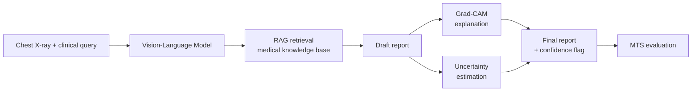

# trustworthy-cxr-vlm

**Enhancing the trustworthiness of Vision-Language Models for chest X-ray diagnosis using RAG, Grad-CAM explainability, and uncertainty estimation, evaluated with a composite Medical Trustworthiness Score (MTS).**

M.Tech Data Science dissertation, Christ University, Bangalore.

> **Status:** Phase I (literature review, problem statement, methodology) complete. Phase II (data audit, preprocessing, and patient-level splitting) complete. Baseline VLM selection in progress.

> **Disclaimer:** This is a research project. It is not a medical device and must not be used for clinical decisions.

---

## Overview

Vision-Language Models (VLMs) can generate radiology reports from images, but four failures keep them out of clinical use:

| Failure | What goes wrong |
| --- | --- |
| Hallucination | Findings are generated with no grounding in verified evidence |
| No explainability | Clinicians cannot see which image regions drove the output |
| Stale knowledge | Static training data misses current clinical guidance |
| Overconfidence | High-confidence answers even when the model is effectively guessing |

Existing studies examine these in isolation, and no shared metric evaluates them together. This project integrates all of them into one pipeline and scores the result with a single metric.

---

## Contribution

1. **Integrated pipeline:** VLM + Retrieval-Augmented Generation (RAG) + Grad-CAM + uncertainty estimation in one system. None of the 30 papers reviewed in Phase I combine all three trust components for medical imaging.
2. **Medical Trustworthiness Score (MTS):** a proposed composite metric covering diagnostic performance, reliability, and explainability.
3. **Stage-wise ablation:** progressive comparison that attributes trustworthiness gains to each component.

---

## Pipeline



| Step | Component | Output |
| --- | --- | --- |
| 1 | Image + clinical query | Combined input for the VLM |
| 2 | Vision-Language Model | Initial understanding of the case |
| 3 | RAG retrieval | Relevant evidence from a medical knowledge base |
| 4 | Draft report | Report grounded in image and retrieved evidence |
| 5 | Grad-CAM | Heatmap of influential image regions |
| 6 | Uncertainty estimation | Confidence signal per prediction |
| 7 | Final output | Report + explanation + confidence flag |
| 8 | MTS | Single trustworthiness score for the system |

---

## Ablation Design

Each stage is scored with MTS to isolate what each component contributes.

| Stage | Configuration |
| --- | --- |
| S0 | Baseline VLM |
| S1 | + RAG |
| S2 | + RAG + XAI (Grad-CAM) |
| S3 | + RAG + XAI + Uncertainty |

---

## Evaluation: Medical Trustworthiness Score

| Dimension | Metrics |
| --- | --- |
| Diagnostic performance | Accuracy, precision, recall, F1 |
| Reliability | Hallucination rate, calibration (ECE, Brier), response time |
| Explainability | Grad-CAM localization accuracy, clinician agreement |
| **MTS** | Weighted composite of the three dimensions (weights to be defined) |

---

## Dataset and Preprocessing

The pipeline uses the **Indiana University Chest X-Ray (IU X-Ray)** collection:
- Total unique patients: 3,851
- Total physical images: 7,470 verified grayscale radiographs
- Benchmark cohort: 3,666 patients (possessing valid reports and frontal views)
- View policy: Frontal projections (PA/AP) serve as primary diagnostic input; lateral views preserved in metadata.

### Patient-Level Partitioning (Seed 42)
| Partition | Patients | % of Benchmark | Abnormal % | Role in Pipeline |
| :--- | :--- | :--- | :--- | :--- |
| `train` | 2,566 | 69.99% | 72.21% | Sole corpus for RAG vector index & VLM adaptation |
| `val` | 366 | 9.98% | 72.40% | Prompt tuning, hyperparameter selection |
| `test` | 734 | 20.02% | 72.21% | Held-out evaluation across S0-S3 ablation stages |
| `excluded_lateral_only` | 162 | N/A | 82.72% | Multi-view / lateral extension studies |
| `excluded_empty_target` | 23 | N/A | 0.00% | Empty findings and impression |

Data is split strictly at the **patient level** (`uid`) with zero patient overlap (`assert len(train_uids & test_uids) == 0`). The RAG knowledge base is built from the training split only to prevent leakage.

---

## Repository Structure

```text
TrustMedicalVLM/
├── configs/
│   └── data_config.yaml         # Central YAML configuration for paths, seed, splits, ontology
├── data/
│   ├── raw/                     # Raw IU X-Ray CSVs and images (images ignored by git)
│   └── processed/               # Processed master CSV, label matrix, splits manifest, summary
├── docs/
│   ├── decision_log.md          # Architecture and engineering decision records (001-012)
│   └── data_card.md             # Standardized dataset documentation card
├── notebooks/                   # Exploratory analysis notebooks
├── reports/
│   ├── data_audit.md            # Comprehensive empirical data audit report
│   ├── audit_metrics.json       # Exact numerical metrics calculated from raw data
│   └── figures/                 # Diagnostic audit figures (PNG)
├── src/
│   ├── __init__.py
│   └── data/
│       ├── __init__.py
│       ├── audit.py             # Deterministic data audit script
│       ├── clean_reports.py     # Text cleaning and de-identification normalization
│       ├── label_derivation.py  # Negation-aware multi-label pathology extraction
│       ├── transforms.py        # Model-agnostic image letterboxing and PyTorch dataset
│       └── split_dataset.py     # Master preprocessing and patient-level splitting
├── tests/
│   ├── test_linkage.py          # Verifies image existence and PIL readability
│   ├── test_splits.py           # Asserts zero patient leakage across train/val/test
│   └── test_transforms.py       # Tests image transform shapes, dtypes, and ranges
├── .gitignore                   # Ignores large raw images, models, checkpoints, caches
└── README.md
```

---

## Reproducing Data Audit and Preprocessing

### 1. Run Data Audit
To run the full empirical audit on raw data and generate figures:
```bash
python src/data/audit.py
```

### 2. Run Preprocessing and Splitting Pipeline
To clean reports, derive labels, perform patient-level splitting, and generate cryptographic file manifests:
```bash
python src/data/split_dataset.py
```

### 3. Run Automated Test Suite
To verify zero leakage, image linkages, and transform correctness:
```bash
python -m pytest tests/ -v
```
All 11 unit tests pass with zero warnings or errors.

---

## Roadmap

- [x] Phase I: literature review, problem statement, objectives, methodology
- [x] Dataset audit and preprocessing (IU X-Ray)
- [ ] Base VLM selection (candidates: LLaVA-Med, CheXagent)
- [ ] S0: baseline VLM inference + MTS
- [ ] S1: RAG integration + MTS
- [ ] S2: Grad-CAM integration + MTS
- [ ] S3: uncertainty estimation + MTS
- [ ] Result analysis and ablation tables
- [ ] Publication

---

## Known Limitations

- Single dataset (IU X-Ray, chest X-rays only), so generalization to other modalities is not claimed.
- IU X-Ray has no gold diagnostic labels or bounding boxes. Labels are derived from reports via clinical rules, and localization evaluation uses anatomical priors and Pointing Game metrics.
- Clinician agreement is evaluated via automated clinical validation proxies (RadGraph entity/relation agreement and CheXbert concordance).

---

## Author

**Justin Thomas**, M.Tech Data Science, Christ University, Bangalore  
**Guide:** Dr. S. A. Sahaaya Arul Mary  

## License

To be added.
