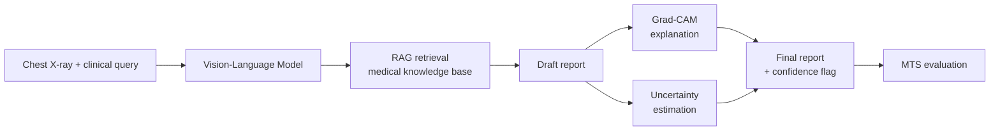

# trustworthy-cxr-vlm

**Enhancing the trustworthiness of Vision-Language Models for chest X-ray diagnosis using RAG, Grad-CAM explainability, and uncertainty estimation, evaluated with a composite Medical Trustworthiness Score (MTS).**

M.Tech Data Science dissertation, Christ University, Bangalore.

> **Status:** Phase I (literature review, problem statement, methodology) complete. Phase II (implementation) in progress. No results are reported yet.

> **Disclaimer:** This is a research project. It is not a medical device and must not be used for clinical decisions.

---

## Overview

Vision-Language Models (VLMs) can generate radiology reports from images, but four failures keep them out of clinical use:

| Failure | What goes wrong |
| --- | --- |
| Hallucination | Findings are generated with no grounding in verified evidence |
| No explainability | Clinicians cannot see which image regions drove the output |
| Stale knowledge | Static training data misses current clinical guidance |
| Overconfidence | High-confidence answers even when the model is effectively guessing |

Existing studies examine these in isolation, and no shared metric evaluates them together. This project integrates all of them into one pipeline and scores the result with a single metric.

## Contribution

1. **Integrated pipeline:** VLM + Retrieval-Augmented Generation (RAG) + Grad-CAM + uncertainty estimation in one system. None of the 30 papers reviewed in Phase I combine all three trust components for medical imaging.
2. **Medical Trustworthiness Score (MTS):** a proposed composite metric covering diagnostic performance, reliability, and explainability.
3. **Stage-wise ablation:** progressive comparison that attributes trustworthiness gains to each component.

## Pipeline



| Step | Component | Output |
| --- | --- | --- |
| 1 | Image + clinical query | Combined input for the VLM |
| 2 | Vision-Language Model | Initial understanding of the case |
| 3 | RAG retrieval | Relevant evidence from a medical knowledge base |
| 4 | Draft report | Report grounded in image and retrieved evidence |
| 5 | Grad-CAM | Heatmap of influential image regions |
| 6 | Uncertainty estimation | Confidence signal per prediction |
| 7 | Final output | Report + explanation + confidence flag |
| 8 | MTS | Single trustworthiness score for the system |

## Ablation Design

Each stage is scored with MTS to isolate what each component contributes.

| Stage | Configuration |
| --- | --- |
| S0 | Baseline VLM |
| S1 | + RAG |
| S2 | + RAG + XAI (Grad-CAM) |
| S3 | + RAG + XAI + Uncertainty |

## Evaluation: Medical Trustworthiness Score

| Dimension | Metrics |
| --- | --- |
| Diagnostic performance | Accuracy, precision, recall, F1 |
| Reliability | Hallucination rate, calibration (ECE, Brier), response time |
| Explainability | Grad-CAM localization accuracy, clinician agreement |
| **MTS** | Weighted composite of the three dimensions (weights to be defined) |

## Dataset

[Indiana University Chest X-ray Collection (IU X-Ray)](https://openi.nlm.nih.gov/faqs), used via a Kaggle mirror containing `indiana_reports.csv`, `indiana_projections.csv`, and the image files.

IU X-Ray was chosen because it provides paired free-text reports, which RAG requires, and it has no credentialing gate. MIMIC-CXR was ruled out due to PhysioNet/CITI access requirements.

Data is split at the **patient level** to prevent leakage. The RAG knowledge base is built from the training split only.

The dataset is not included in this repository. Download it from Kaggle and place it under `data/raw/`.

## Roadmap

- [x] Phase I: literature review, problem statement, objectives, methodology
- [ ] Dataset audit and preprocessing (IU X-Ray)
- [ ] Base VLM selection (candidates: LLaVA-Med, CheXagent)
- [ ] S0: baseline VLM inference + MTS
- [ ] S1: RAG integration + MTS
- [ ] S2: Grad-CAM integration + MTS
- [ ] S3: uncertainty estimation + MTS
- [ ] Result analysis and ablation tables
- [ ] Publication

## Repository Structure

```
trustworthy-cxr-vlm/
├── configs/          # YAML experiment configs
├── data/
│   ├── raw/          # Downloaded dataset (not tracked)
│   └── processed/    # Cleaned tables and split manifests
├── src/              # Pipeline source code
├── notebooks/        # Exploration and analysis
├── reports/          # Data audit and result reports
├── docs/             # Decision log and design notes
├── tests/            # Leakage and integrity checks
└── README.md
```

## Known Limitations

- Single dataset (IU X-Ray, chest X-rays only), so generalization to other modalities is not claimed.
- IU X-Ray has no gold diagnostic labels or bounding boxes. Labels will be derived from reports, and localization evaluation requires a documented proxy or annotated subset.
- Clinician agreement depends on access to clinical reviewers.

## Author

**Justin Thomas**, M.Tech Data Science, Christ University, Bangalore
Guide: Dr. S. A. Sahaaya Arul Mary

## License

To be added.
