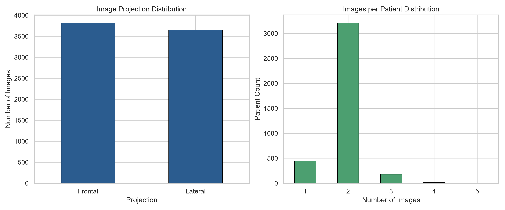
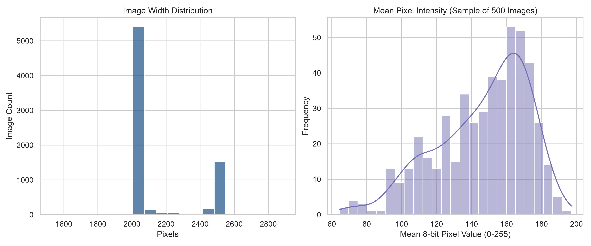
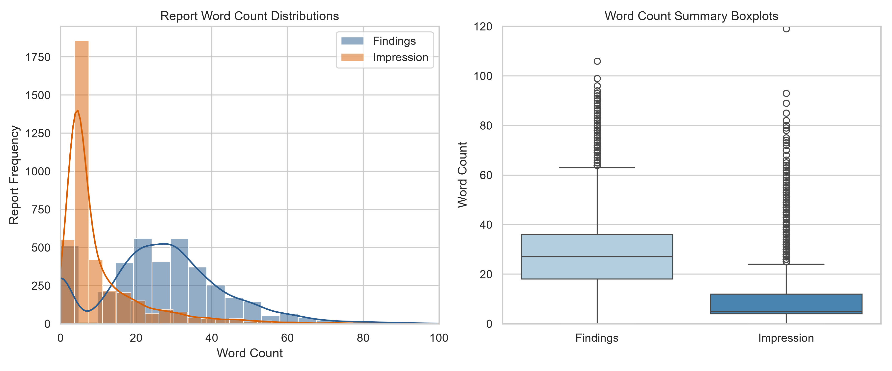
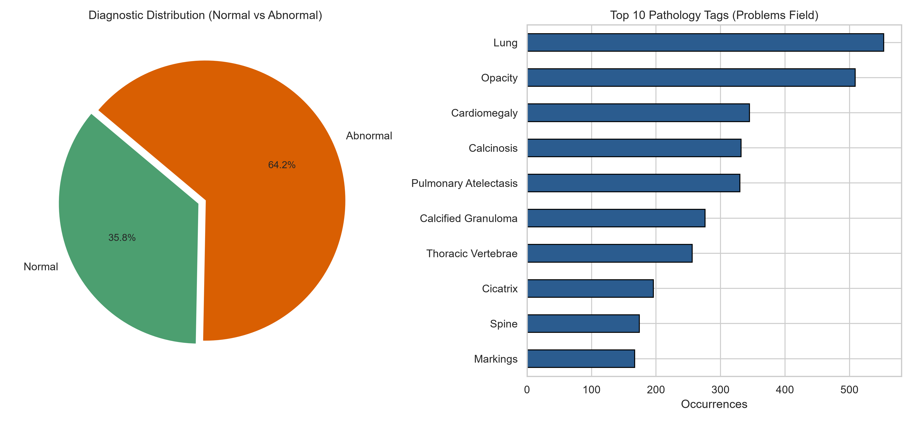

# Comprehensive Data Audit Report: Indiana University Chest X-Ray (IU X-Ray) Dataset

Project: Enhancing Trustworthiness of Vision-Language Models for Medical Image Diagnosis  
Institution: Christ University, Bangalore (M.Tech Dissertation)  
Date: 2026-09-20  
Auditor: Antigravity Automated Verification Agent  

---

## 1. Executive Summary
This report presents an empirical audit of the Indiana University Chest X-Ray (IU X-Ray) dataset stored in `data/raw/`. The audit was conducted using deterministic scripts (`src/data/audit.py`) on 100% of raw tabular and image records. 

Key findings:
- Total unique patients (`uid`): 3,851.
- Total tabular projection references: 7,466 across 3,851 patients.
- Total physical images on disk: 7,470 (0 unreadable/corrupt, 0 missing, 4 orphan files).
- View distribution: 3,818 Frontal (51.14%) and 3,648 Lateral (48.86%). 3,388 patients have both views; 162 patients have only Lateral views (no Frontal).
- Text availability: 514 reports lack Findings (13.35%), 31 lack Impression (0.80%), and 25 lack both (0.65%).
- De-identification prevalence: 79.25% of reports (3,052 / 3,851) contain hospital de-identification placeholders (`XXXX`), totaling 7,118 tokens.
- Diagnostic balance: 35.81% Normal (1,379) vs 64.19% Abnormal (2,472).

---

## 2. Dataset Schema and Tabular Completeness

### 2.1 Reports Table (`indiana_reports.csv`)
- Row count: 3,851 rows (0 duplicate rows).
- Unique identifier: `uid` is strictly unique (3,851 unique values, 0 duplicates).
- Data types: `uid` (int64), all remaining columns (object / string).

| Column | Non-Null Count | Missing Count | Missing % | Description |
| :--- | :--- | :--- | :--- | :--- |
| `uid` | 3,851 | 0 | 0.00% | Unique patient study identifier |
| `MeSH` | 3,851 | 0 | 0.00% | Medical Subject Headings diagnostic annotations |
| `Problems` | 3,851 | 0 | 0.00% | Normalized pathology concept terms |
| `image` | 3,851 | 0 | 0.00% | Clinical imaging examination descriptor string |
| `indication` | 3,765 | 86 | 2.23% | Clinical reason for examination / patient symptoms |
| `comparison` | 2,685 | 1,166 | 30.28% | Prior imaging exam reference notes |
| `findings` | 3,337 | 514 | 13.35% | Detailed radiological observations |
| `impression` | 3,820 | 31 | 0.80% | Definitive diagnostic summary |

### 2.2 Projections Table (`indiana_projections.csv`)
- Row count: 7,466 rows (0 duplicate rows).
- Unique identifier: 3,851 unique `uid` values, 7,466 unique filenames.
- Missing values: 0 missing values across all columns.

| Column | Non-Null Count | Missing Count | Missing % | Description |
| :--- | :--- | :--- | :--- | :--- |
| `uid` | 7,466 | 0 | 0.00% | Patient study identifier linking to reports |
| `filename` | 7,466 | 0 | 0.00% | Image filename on disk |
| `projection` | 7,466 | 0 | 0.00% | Radiographic projection (Frontal or Lateral) |

---

## 3. Patient and Projection Architecture

### 3.1 Projection Counts
- Frontal projections: 3,818 (51.14%)
- Lateral projections: 3,648 (48.86%)
- Other / unspecified projections: 0 (0.00%)

### 3.2 Images per Patient
- Minimum images: 1
- Maximum images: 5
- Mean images per patient: 1.94
- Median images per patient: 2.00

| Images per Patient | Patient Count | Percentage |
| :--- | :--- | :--- |
| 1 image | 446 | 11.58% |
| 2 images | 3,210 | 83.36% |
| 3 images | 181 | 4.70% |
| 4 images | 13 | 0.34% |
| 5 images | 1 | 0.03% |

### 3.3 Patient View Availability
- Both Frontal and Lateral views available: 3,388 patients (87.98%)
- Frontal view only: 301 patients (7.82%)
- Lateral view only: 162 patients (4.21%)
- Neither view: 0 patients (0.00%)
- Total patients with at least one Frontal view: 3,689 patients (95.79%)
- Total patients with no Frontal view: 162 patients (4.21%)

---

## 4. Image-Report Linkage and File Integrity

### 4.1 Cross-Table Linkage
- Reports `uid` count: 3,851
- Projections `uid` count: 3,851
- Common `uid` count: 3,851 (100% mutual coverage; 0 reports without projections, 0 projections without reports).

### 4.2 Disk File Verification
- Physical files in `data/raw/images/images_normalized`: 7,470
- Filenames referenced in `indiana_projections.csv`: 7,466
- Missing files from disk: 0 (100% of referenced files exist on disk).
- Orphan files on disk (not referenced in CSV): 4 files
  - `2084_IM-0715-1001-0002.dcm.png`
  - `2084_IM-0715-2001-0001.dcm.png`
  - `2560_IM-1064-4001.dcm.png`
  - `3809_IM-1919-1003002.dcm.png`
- Corrupt or unreadable files: 0 (all 7,470 files opened and validated with PIL).

### 4.3 Image Format, Dimensions, and Intensity Statistics
- Image Mode: 100% grayscale (`L` mode, 8-bit, 7,470 files).
- Width distribution: Min = 1,529 px, Max = 2,891 px, Mean = 2,155.77 px.
- Height distribution: Min = 1,760 px, Max = 3,001 px, Mean = 2,220.37 px.
- Intensity statistics (sampled over 500 images):
  - Mean pixel intensity: 146.29 / 255.0
  - Standard deviation: 26.26 / 255.0
- Outlier check: No zero-byte files or corrupted headers detected. Resolution ranges are typical for high-resolution digitized chest radiographs.

---

## 5. Report Text Statistics and De-identification

### 5.1 Text Length Distribution
- Findings word count: Mean = 27.26 words, Median = 27.0 words, Max = 169 words.
- Impression word count: Mean = 10.48 words, Median = 5.0 words, Max = 130 words.
- Combined Target (Findings + Impression) word count: Mean = 37.73 words, Median = 34.0 words, Max = 230 words.

| Metric | Findings | Impression | Combined Target |
| :--- | :--- | :--- | :--- |
| Mean Character Length | 190.24 | 74.15 | 264.39 |
| Mean Word Length | 27.26 | 10.48 | 37.73 |
| Median Word Length | 27.0 | 5.0 | 34.0 |
| Max Word Length | 169 | 130 | 230 |
| Empty Records Count | 514 (13.35%) | 31 (0.80%) | 25 (0.65%) |

### 5.2 De-identification Placeholders (`XXXX`)
- Total `XXXX` occurrences: 7,118 tokens across the dataset.
- Reports containing >= 1 `XXXX` token: 3,052 reports (79.25% of all reports).
- Average `XXXX` tokens per report: 1.85 tokens.
- Common contextual patterns:
  - Dates and years: `XXXX, XXXX at XXXX hours`, `dated XXXX`
  - Patient demographics: `XXXX-year-old XXXX`
  - Healthcare provider names: `Dr. XXXX`, `by Dr. XXXX XXXX telephone`
  - Anonymized anatomical identifiers: `midline sternotomy XXXX`

---

## 6. Diagnostic Label Landscape

### 6.1 Normal vs Abnormal Distribution
- Normal reports: 1,379 (35.81%)
- Abnormal reports: 2,472 (64.19%)
- Overall imbalance ratio: 1.79:1 (Abnormal to Normal).

### 6.2 Top Pathology Findings in Problems Field
1. Lung (parenchymal observations): 553
2. Opacity: 509
3. Cardiomegaly: 345
4. Calcinosis: 332
5. Pulmonary Atelectasis: 330
6. Calcified Granuloma: 276
7. Thoracic Vertebrae degenerative changes: 256
8. Cicatrix (scarring): 196
9. Spine changes: 174
10. Bronchovascular Markings: 167
11. Pleural Effusion: 160
12. Aorta / tortuous aorta: 158
13. Diaphragm: 140
14. Density: 129
15. Atherosclerosis: 125

---

## 7. Threats to the Evaluation Plan and Mitigation Strategy

1. **Patients Without Frontal Views (162 patients, 4.21%)**:
   - Risk: Single-image VLM baselines (S0) trained on frontal projections will experience severe modality shift if evaluated on lateral views without differentiation.
   - Mitigation: Implement Decision Record 007. Establish Frontal view as primary diagnostic requirement. Patients lacking frontal views will be archived in metadata for lateral multi-view studies, but excluded from primary single-image benchmark partitions.

2. **Empty Findings (514 reports, 13.35%) and Empty Impression (31 reports, 0.80%)**:
   - Risk: Generative VLM loss and RAG grounding scores collapse when target text is empty.
   - Mitigation: Records with both sections empty (25 reports) must be dropped from generative training and evaluation. For records missing Findings but possessing an Impression (489 reports), the target text defaults to Impression.

3. **High De-identification Token Density (79.25% of reports)**:
   - Risk: Generative VLMs will memorize and hallucinate meaningless `XXXX` strings, which corrupts lexical and clinical NLP evaluation metrics (BLEU, ROUGE, RadGraph).
   - Mitigation: Clean and normalize `XXXX` tokens into standard semantic tags (`[DATE]`, `[AGE]`, `[DOCTOR]`, `[REDACTED]`) during Step 2 preprocessing.

4. **Multi-Image Patient Structure and Data Leakage**:
   - Risk: Random image-level splitting will put frontal views in train and lateral views of the same patient in test, causing severe diagnostic leakage.
   - Mitigation: Implement Decision Record 004. Enforce strict patient-level splitting (`uid`) with zero patient overlap across train, val, and test, verified by hard assertion tests.

5. **Class Imbalance Across Thoracic Pathologies**:
   - Risk: Common conditions (Cardiomegaly, Atelectasis) outnumber rarer conditions (Pneumothorax, Hernia), leading to misleading macro-F1 scores.
   - Mitigation: Stratify patient splits on normal vs abnormal diagnosis, compute both macro-averaged and per-class metrics, and report ECE calibration across confidence bins.
